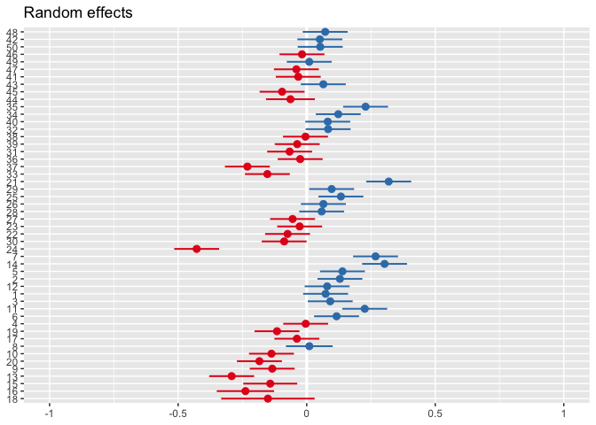

Mixed Effect Models in R
================
J. Zeldin - Research Ecologist, Chicago Botanic Garden

## What Are Mixed Effect Models?

Mixed effect models, generally, are extensions of linear models that
incorporate both “fixed” and “random” effects (more on this later),
allowing analysts to model hierarchical or multi-level structure in data
sets. This facilitates the modelling of complex data sets while taking
into account meaningful correlations within groups/hierarchical tiers,
compensates for longitudinal data or psuedoreplication, and allows for
variance partitioning.

Mixed-modeling techniques go by a number of different names, such as:
Hierarchical modeling, multi-level modeling, mixed modeling, partial
pooling, etc. Just keep in mind that, though these approaches differ in
naming conventions, they are all basically describing the same
techniques.

## Fixed and Random Effects

When working with mixed effect models, you can include two types of
effects/predictor variables (hence “mixed effect”): “Fixed” and
“Random”.

  - **Fixed effects** typically refer to those that are of interest in
    the context of the study - we are typically interested in how a
    response varies across levels of a fixed effect. In the case of
    categorical variables, fixed effects typically exhaust all the
    possible levels of that variable.
  - **Random effects** typically refer to a factor/variable where the
    levels are representative of samples from a larger population. These
    are typically not exhaustive of all possible factor levels. Often we
    are not necessarily interested in the discrete influence that each
    individual level of the random effect has on the response, rather,
    we want to account for the variation introduced by the random effect
    and the correlation that may occur between measurements within the
    same level of the random effect.

Fixed effects are the variables we are usually most familiar with. If we
are studying the effect of fertilizer levels on plant growth across a
few dozen farms, our fixed effect is likely to be the amount of
fertilizer applied. This could be categorical (control, low, medium,
high) or continuous (0 g/m2, 2 g/m2, 3.4 g/m2, 5 g/m2, etc.). The point
is that this is the main effect we are interested in investigating.

Random effects we may be less familiar with. In the example above, which
farm a measurment comes from may be the random effect. We aren’t
particularly interested in differences between farms, but we want to
account for the variation associated with differences between farms.
Furthermore, if we have multiple readings from the same farm, we want to
account for correlations between those readings. Ultimately, we really
just want to understand the influence of the fixed effects in the larger
population (all the farms, not just the ones we sampled) while
“smoothing” over the variation associated with random effect.

There is some grey areas between these two types of effects, so think
critically about your data and what each variable is really
representing. For the majority of cases, however, the distinction
between fixed and random effects should be pretty clear but there is
often room for interpretation in the context of your study.

## Complete-, No-, and Partial-Pooling

Let’s turn our attention to a built-in R data set, Chick Weights. These
data come from a study in which four different Diets were fed to a
number of chicks, and their weight was recorded over 20 days. The data
look like this:

``` r
head(ChickWeight,20)
```

    ## Grouped Data: weight ~ Time | Chick
    ##    weight Time Chick Diet
    ## 1      42    0     1    1
    ## 2      51    2     1    1
    ## 3      59    4     1    1
    ## 4      64    6     1    1
    ## 5      76    8     1    1
    ## 6      93   10     1    1
    ## 7     106   12     1    1
    ## 8     125   14     1    1
    ## 9     149   16     1    1
    ## 10    171   18     1    1
    ## 11    199   20     1    1
    ## 12    205   21     1    1
    ## 13     40    0     2    1
    ## 14     49    2     2    1
    ## 15     58    4     2    1
    ## 16     72    6     2    1
    ## 17     84    8     2    1
    ## 18    103   10     2    1
    ## 19    122   12     2    1
    ## 20    138   14     2    1

Let’s say that the purpose of the study was primarily to understand how
the different diets impact growth rate in chicks in a large farm in
United States. In the study, each diet was fed to a ten random chicks
hatched on the farm, but these chicks only represent a subsample of the
population. Obviously we can’t sample all the chicks in the world, or
even in this single farm. Since we are interested in the effect of Diet
on weight over time, we can use modeling to make inferences about the
effect of diet on the weights of the larger population.

In these data, each diet was fed to multiple chicks but these chicks are
not exhaustive of all factor levels. That is, every single chick on the
farm (or every chick in the United States, or world, or universe) could
not be included in the experiment. We are hoping to use data from
multiple chicks to inform our investigation into the broader effect of
Diet on chick weight over time. Thus, we can think of the variable
“chick” as a random effect. We can deal with this random effect in a
few different ways. One way is to “smooth” over the variation from a
random effect by using partial pooling. We’ll get to what that means in
a second, but first let’s discuss the two alternate approaches: no
pooling and complete pooling.

#### No pooling

The first approach is no pooling, in which we make seperate estimates
for each individual chick. This is referred to as no pooling because we
aren’t combining, or pooling, any of the chicks together. In this
scenario, we would fit seperate trend lines for each individual chick. A
plot of this might look something like this:

<!-- -->

In the plot above, we can see that each diet (coded by color) is fed to
a number of chicks and the trend lines are slightly different for each.
If we were to model this with no pooling, we would be estimating a
different intercept (and slope if we included an interaction term) for
each individual chick. In this example with no pooling, we are
estimating at least 47 intercepts. With some data sets this could be a
big problem - with each model paremeter we have to estimate, we lose
degrees of freedom. We must balance the complexitity of the model with
the size of the data.

Furthermore, we aren’t particularly interested in the discrete
differences from each individual chick. We want to understand the
overall relationship between diet, time, and weight. So we aren’t
gaining much, and potentially losing a lot, from using a no pooling
approach. No pooling models also have a tendancy to overfit the data,
inflating type-II errors and potentially suggesting trends that aren’t
generalizable for the larger population.

#### Complete pooling

An alternate approach to dealing with the random effect of “chick” is to
use complete pooling. In complete pooling, all the information from all
the chicks are pooled together. In the ChickWeights examplem, that means
thatthe information from all 10 chicks that were fed diet 1 will be
pooled and the information from all chicks fed diet 2 will be pooled and
so on. Below is what a plot of this would look like:

<!-- -->

As shown above, a model of the ChickWeights data using complete pooling
fits a single trend line to each diet, pooling across the variation from
the individual chicks.

Complete pooling is a common approach in biological and ecological
analysis. This type of analysis can work if sample sizes are large and
conditions tightly controlled as it averages across the noise introduced
by variation in individual measurements. However, in reality, this model
ignores the fact the the data come from different individuals and it
does not account for correlated measurements of the same individual at
different time points. This can cause problems with over generalizing
results and may do a poor job at representing the true relationship
between the diets and chick weight over time.

#### Partial pooling

Mixed-effect models employ the third approach, partial pooling. Partial
pooling takes into account the influence of random effects by
introducing new variance terms to the model. Essentially, we can use
information from all of the lines from each individual chick to improve
the fit of the single lines fit for each diet. Partial pooling, in
effect, pulls the estimates for each of the random effect levels towards
the grand mean. This shrinkage also helps to accomodate more extreme
observations.

This works by allowing intercepts (or slopes) of the random effect
factor levels to “randomly vary” from the intercetps (or slope) of the
fixed effects and intercepts. This allows us to incorportate information
from the random effects without estimating seperate intercepts for each
factor level and saves us from losing all those degrees of freedom. It
acknowledges correlation between measurments stemming form the same
random effect level and addresses the issues associated with
longitudinal data or psuedo-replication.

Below are the plotted trend lines for the partial pooling model in color
and the complete pooling model in dashed lines:

<!-- -->

While the two model predictions are quite similar in this case, there
can be large differences depending on the data. The mixed-effect model
also gives additional information about the variation from the
individual random effect levels. We can plot the variation of the random
effect levels from the fixed intercept (the fixed intercept is 0 on the
X axis) with a forest plot:

<!-- -->

And we can calculate the intra-class correlation coefficient, or the
proportion of the variation that can be attributed to differences
between random effect levels:

``` r
vc <- as_tibble(VarCorr(cw1))
icc <- vc[1,"vcov"]/(vc[1,"vcov"] + vc[2,"vcov"])
icc
```

    ##       vcov
    ## 1 0.499562

With an ICC of ~0.5, roughly half of the remaining variation can be
attributed to differences between chicks.

We can also plot the predictions for each random effect level in our
facetted plot. Here we plot the artially pooled prediction as a dashed
line overlaid across colored lines with estimates for each random effect
level:

<!-- -->

Had we treated this model with no pooling, those random effect estimates
would be much more far flung from the average. With partial pooling, we
shrink those random effect estimates toward the overall
mean.

## Random Effect Structure

#### \*Special thanks to Tristan Mahr at UW - Madison whose blog massively helped build the pooling portion of this document\!
